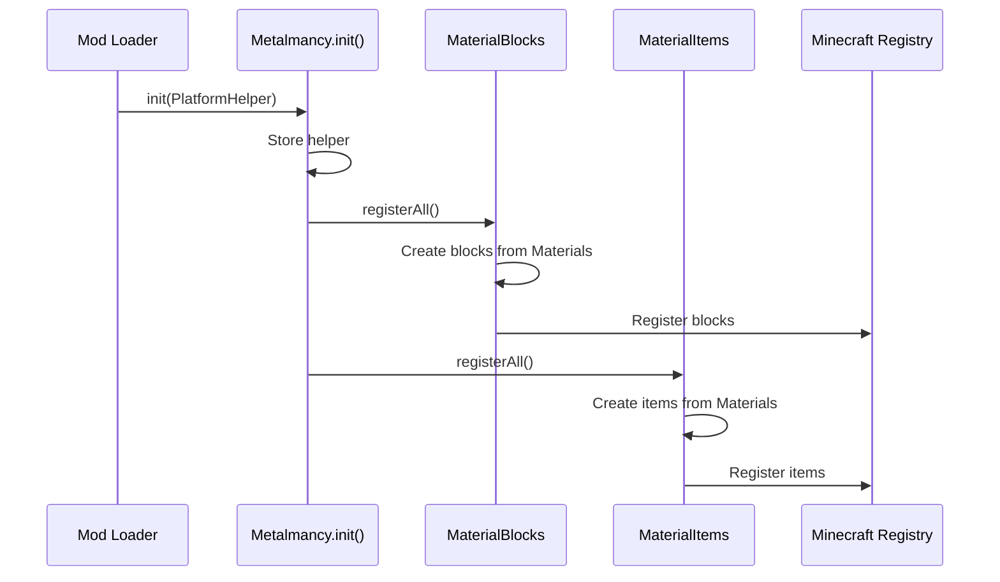
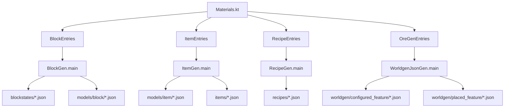
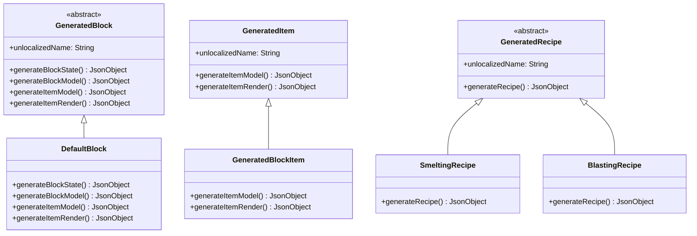

# Documento de Design - Sistema de Materiais do Metalmancy

## Visão Geral

O Sistema de Materiais do Metalmancy é uma arquitetura baseada em dados que permite a definição declarativa de materiais (metais, gemas, sais) e a geração automática de todos os recursos necessários para o Minecraft. O sistema é composto por:

1. **Core Material System**: Define materiais e suas propriedades
2. **Runtime Registration**: Registra blocos e itens no Minecraft durante a inicialização
3. **Build-time Generators**: Gera assets JSON (blockstates, modelos, receitas, worldgen)
4. **Multi-platform Support**: Estruturado para compatibilidade com Fabric e NeoForge via Architectury (atualmente apenas Fabric está funcional)

O design segue o princípio DRY (Don't Repeat Yourself) - materiais são definidos uma vez e todos os recursos são gerados automaticamente.

**Status Atual:** O mod está totalmente funcional no Fabric. A implementação NeoForge está em desenvolvimento.

**Implementação Atual:**
- ✅ Sistema core de materiais (Material, Family, Part)
- ✅ Catálogo completo de materiais (Materials.kt)
- ✅ Sistema de registro de blocos (MaterialBlocks.kt)
- ✅ Block Generator (BlockGen.kt)
- ✅ Item Generator (ItemGen.kt)
- ✅ Recipe Generator (RecipeGen.kt)
- ✅ Loot Generator (LootGen.kt)
- ✅ Worldgen Generator (WorldgenJsonGen.kt)
- ⏳ Sistema de registro de itens (MaterialItems.kt) - pendente
- ⏳ Integração completa com Gradle - pendente
- ⏳ Testes de propriedade - pendente
- ⏳ Implementação NeoForge - pendente

## Arquitetura

### Estrutura de Módulos

```
metalmancy/
├── common/              # Código compartilhado
│   ├── src/main/        # Código runtime
│   │   ├── kotlin/      # Lógica do mod
│   │   └── resources/   # Assets e data
│   └── src/tools/       # Geradores build-time
├── fabric/              # Implementação Fabric
└── neoforge/            # Implementação NeoForge
```

### Fluxo de Dados

```
Material Definition (Kotlin)
    ↓
Runtime Registration → Minecraft Registry
    ↓
Build-time Generation → JSON Assets
    ↓
Game Loading → Minecraft Resources
```

### Separação de Responsabilidades

- **Material.kt**: Define estrutura de dados de materiais
- **Materials.kt**: Catálogo de todos os materiais
- **MaterialBlocks.kt**: Registro runtime de blocos
- **MaterialItems.kt**: Registro runtime de itens
- **Generators**: Geração build-time de assets

## Componentes e Interfaces

### 1. Core Material System

#### Material Data Class

```kotlin
data class Material(
    val name: String,
    val family: Family,
    val parts: Set<Part>
)
```

**Responsabilidades:**
- Armazenar definição de material
- Gerar nomes não-localizados para partes
- Fornecer acesso às partes configuradas

#### Family Enum

```kotlin
enum class Family { 
    METAL, ALLOY, GEM, SALT, STONE, BONE, FABRIC 
}
```

**Responsabilidades:**
- Categorizar materiais
- Permitir aplicação de propriedades específicas por família

#### Part Enum

```kotlin
enum class Part(val isBlock: Boolean = false) {
    ORE(true), ORE_DEEPSLATE(true),
    RAW_BLOCK(true), BLOCK(true),
    RAW_ITEM, INGOT, NUGGET, GEM, DUST
}
```

**Responsabilidades:**
- Definir formas possíveis de materiais
- Indicar se a parte é bloco ou item
- Fornecer base para geração de nomes

#### Materials Object

```kotlin
object Materials {
    val RUBY = Material("ruby", Family.GEM, setOf(...))
    val ZINC = Material("zinc", Family.METAL, setOf(...))
    // ...
    
    val GEMS = listOf(RUBY, SAPPHIRE, TOPAZ)
    val ALCHEMY = listOf(ROCK_SALT, POTASH, MERCURY)
    val METALS = COPPER_LIKE_METALS + IRON_LIKE_METALS + ...
    val ALL = GEMS + ALCHEMY + METALS + ALLOYS
}
```

**Responsabilidades:**
- Catálogo central de todos os materiais
- Agrupamento por categoria
- Fonte única de verdade para definições

### 2. Runtime Registration System

#### MaterialBlocks Object

```kotlin
object MaterialBlocks {
    val GEMS: Map<Material, Map<Part, Block>>
    val SALTS: Map<Material, Map<Part, Block>>
    val METALS: Map<Material, Map<Part, Block>>
    
    fun createLike(id: String, block: Block): BlockBehaviour.Properties
    fun registerAll()
}
```

**Responsabilidades:**
- Criar blocos para cada material/parte
- Aplicar propriedades baseadas em blocos vanilla
- Registrar blocos no Minecraft Registry
- Organizar blocos por categoria

**Estratégia de Propriedades:**
- Gemas → propriedades similares a blocos vanilla
- Alchemy → propriedades similares a blocos vanilla
- Metais copper-like (nível cobre) → propriedades de COPPER_ORE
- Metais iron-like (nível ferro) → propriedades de IRON_ORE
- Metais diamond-like (nível diamante) → propriedades de DIAMOND_ORE
- Metais netherite-like (nível netherite) → propriedades customizadas

**CRÍTICO - Inicialização de Block ID (Minecraft 1.21.10+):**

A partir do Minecraft 1.21.10, o construtor de Block valida que o block ID interno está definido antes de permitir a criação do bloco. A solução é chamar `.setId()` nas propriedades ANTES de criar o bloco:

```kotlin
// ❌ ERRADO - Causa NullPointerException: Block id not set
fun createLike(id: String, block: Block): BlockBehaviour.Properties {
    return BlockBehaviour.Properties.ofFullCopy(block)
}

// ✅ CORRETO - Define o ID antes de criar o bloco
fun createLike(id: String, block: Block): BlockBehaviour.Properties =
    BlockBehaviour.Properties.ofFullCopy(block).setId(Metalmancy.resourceKey(id, Registries.BLOCK))
```

**Implementação Correta:**

A chave é usar inicialização direta (não lazy) e inline a criação de propriedades:

```kotlin
val GEMS: Map<Material, Map<Part, Block>> = Materials.GEMS.associateWith { material ->
    material.parts.filter { it.isBlock }.associateWith { part ->
        val id = material.unlocalizedName(part)
        val properties = createLike(id, Blocks.EMERALD_ORE)
        register(id, Block(properties))
    }
}
```

**Por que isso funciona:**
1. Inicialização direta (não `by lazy`) garante que a ordem de execução é previsível
2. `createLike()` define o ResourceKey via `.setId()` ANTES do bloco ser construído
3. O ID está disponível quando `Block(properties)` é chamado
4. Registro acontece imediatamente após criação

**Por que lazy initialization falha:**
- `by lazy` adia a execução até o primeiro acesso
- Durante lazy evaluation, o contexto de registro pode não estar pronto
- Fabric pode tentar acessar propriedades do bloco antes do ID ser definido

**Ordem de Operações Correta:**
1. Gerar ID do bloco: `material.unlocalizedName(part)`
2. Criar properties com ID: `createLike(id, vanillaBlock)` → chama `.setId()`
3. Construir bloco: `Block(properties)` → ID já está definido
4. Registrar: `register(id, block)`

Esta implementação segue o padrão de `io.felipeandrade.metalmancy.blocks.MaterialBlocks` (implementação funcional).

#### MaterialItems Object

```kotlin
object MaterialItems {
    val RUBY: Map<Part, Item>
    val ZINC: Map<Part, Item>
    // ...
    
    fun registerAll()
}
```

**Responsabilidades:**
- Criar itens para cada material/parte
- Criar BlockItems para blocos
- Registrar itens no Minecraft Registry
- Mapear partes para itens

**Implementação:**

Similar a MaterialBlocks, usa inicialização direta e `.setId()` para BlockItems:

```kotlin
val RUBY: Map<Part, Item> = mapItems(Materials.RUBY, MaterialBlocks.GEMS[Materials.RUBY])

private fun mapItems(
    material: Material,
    blocks: Map<Part, Block>? = MaterialBlocks.METALS[material]
): Map<Part, Item> {
    val blockItems: Map<Part, Item> = blocks?.entries?.associate { (part, block) ->
        part to register(material.unlocalizedName(part), block)
    } ?: emptyMap()
    val items: Map<Part, Item> = material.parts.filter { it.isBlock.not() }.associateWith { part ->
        register(material.unlocalizedName(part))
    }
    return blockItems + items
}

private fun register(path: String, block: Block, properties: Item.Properties = Item.Properties()): BlockItem {
    val key = Metalmancy.resourceKey(path, Registries.ITEM)
    val props = properties.useBlockDescriptionPrefix().setId(key)
    return Registry.register(BuiltInRegistries.ITEM, key, BlockItem(block, props))
}
```

**Pontos-chave:**
- Inicialização direta (não lazy) para garantir ordem de execução
- `.setId()` é chamado nas propriedades do item antes de criar o BlockItem
- `useBlockDescriptionPrefix()` garante que BlockItems usem descrições de bloco
- Itens regulares usam `Items.registerItem()` do Minecraft
- BlockItems são registrados manualmente com `Registry.register()`

### 3. Build-time Generators

#### Block Generator

**Status:** ✅ Implementado em `common/src/tools/blockgen/`

**Entrada:** `BlockEntries.blocks` (lista de GeneratedBlock)
- BlockEntries itera automaticamente sobre `Materials.ALL` e cria um `DefaultBlock` para cada parte que é bloco

**Saída:**
- `blockstates/<name>.json` - Define estados do bloco
- `models/block/<name>.json` - Define modelo 3D do bloco

**Estrutura:**
```kotlin
abstract class GeneratedBlock(val unlocalizedName: String) {
    abstract fun generateBlockState(): JsonObject
    abstract fun generateBlockModel(): JsonObject
    abstract fun generateItemModel(): JsonObject
    abstract fun generateItemRender(): JsonObject
}

class DefaultBlock : GeneratedBlock {
    // Implementação para blocos cúbicos simples
}
```

**Uso:**
```bash
./gradlew :common:generateBlockJson --args="--out build/generated/assets"
```

**Formato de Saída (blockstate):**
```json
{
  "variants": {
    "": {
      "model": "metalmancy:block/ruby_ore"
    }
  }
}
```

**Formato de Saída (block model):**
```json
{
  "parent": "minecraft:block/cube_all",
  "textures": {
    "all": "metalmancy:block/ruby_ore"
  }
}
```

#### Item Generator

**Status:** ✅ Implementado em `common/src/tools/itemgen/`

**Entrada:** 
- `ItemEntries.items` (lista de GeneratedItem) - itera sobre Materials.ALL
- `BlockEntries.blocks` (lista de GeneratedBlock) - para gerar modelos de item correspondentes

**Saída:**
- `models/item/<name>.json` - Define modelo do item
- `items/<name>.json` - Define renderização do item

**Estrutura:**
```kotlin
open class GeneratedItem(val unlocalizedName: String) {
    open fun generateItemModel(): JsonObject
    open fun generateItemRender(): JsonObject
}

class GeneratedBlockItem : GeneratedItem {
    // Referencia modelo do bloco
}
```

**Uso:**
```bash
./gradlew :common:generateItemJson --args="--out build/generated/assets"
```

**Formato de Saída (item model):**
```json
{
  "parent": "minecraft:item/generated",
  "textures": {
    "layer0": "metalmancy:item/ruby"
  }
}
```

#### Recipe Generator

**Status:** ✅ Implementado em `common/src/tools/recipegen/`

**Entrada:** `RecipeEntries.recipes` (lista de GeneratedRecipe)
- RecipeEntries usa `Recipes.byFamily()` para gerar receitas baseadas na família do material

**Saída:**
- `recipes/<name>.json` - Define receita de crafting/smelting

**Estrutura:**
```kotlin
abstract class GeneratedRecipe(val unlocalizedName: String) {
    abstract fun generateRecipe(): JsonObject
}

class SmeltingRecipe : GeneratedRecipe
class BlastingRecipe : GeneratedRecipe
```

**Lógica de Geração:**
- Metais: gera smelting e blasting para ORE → INGOT e ORE_DEEPSLATE → INGOT
- Gemas: gera smelting para ORE → GEM e ORE_DEEPSLATE → GEM
- Outras famílias: sem receitas automáticas

**Uso:**
```bash
./gradlew :common:generateRecipeJson --args="--out build/generated/data"
```

**Formato de Saída (smelting):**
```json
{
  "type": "minecraft:smelting",
  "category": "blocks",
  "group": "zinc_ingot",
  "ingredient": {
    "item": "metalmancy:zinc_ore"
  },
  "result": {
    "id": "metalmancy:zinc_ingot"
  },
  "experience": 0.1,
  "cookingtime": 200
}
```

#### Loot Generator

**Status:** ✅ Implementado em `common/src/tools/lootgen/`

**Entrada:** `LootEntries.entries` (lista de GeneratedLoot)
- Lista manual de materiais com seus drops configurados

**Saída:**
- `loot_table/blocks/<name>_ore.json` - Define loot table para minério normal
- `loot_table/blocks/<name>_deepslate_ore.json` - Define loot table para minério deepslate

**Estrutura:**
```kotlin
data class GeneratedLoot(
    val oreName: String,
    val drop: Part = Part.RAW_ITEM,
    val ores: List<Part> = listOf(Part.ORE, Part.ORE_DEEPSLATE)
)
```

**Lógica de Geração:**
- Gemas: dropam GEM (com fortune)
- Sais: dropam DUST (com fortune)
- Metais: dropam RAW_ITEM (com fortune)
- Silk Touch: dropa o próprio bloco de minério
- Explosion decay aplicado automaticamente

**Uso:**
```bash
./gradlew :common:generateLootJson --args="--out build/generated/loot_table"
```

#### Worldgen Generator

**Status:** ✅ Implementado em `common/src/tools/worldgen/`

**Entrada:** `OreGenEntries.overworld/nether/ender` (lista de OreGen)
- OreGenEntries filtra `Materials.ALL` para materiais com `Part.ORE`
- Configurações específicas por material (yRange, veinSize, countPerChunk)
- Suporte para múltiplas dimensões (overworld, nether, end)

**Saída:**
- `worldgen/configured_feature/<name>.json` - Define feature de minério
- `worldgen/placed_feature/oregen_<name>.json` - Define placement de minério

**Estrutura:**
```kotlin
data class OreGen(
    val ore: String,                                      // Nome do minério (stone variant)
    val deepslate: String? = null,                        // Nome do minério deepslate (opcional)
    val yRange: IntRange = -80..80,                       // Faixa de altura Y
    val heightType: OreGenHeightType = TRAPEZOID,         // Tipo de distribuição
    val veinSize: Int = 4,                                // Tamanho do veio
    val countPerChunk: Int = 7,                           // Tentativas por chunk
    val suffix: String? = null,                           // Sufixo para múltiplas configs
    val targets: List<OreGenTarget>? = null               // Targets customizados (opcional)
)

enum class OreGenHeightType(val id: String) {
    TRAPEZOID("minecraft:trapezoid"),
    TRIANGLE("minecraft:triangle"),
    UNIFORM("minecraft:uniform")
}
```

**Lógica de Geração:**
- Itera sobre materiais com Part.ORE
- Aplica configurações específicas por material (yRange, veinSize, etc.)
- Suporta múltiplas configurações por material (com sufixos)
- Gera targets para stone_ore_replaceables e deepslate_ore_replaceables
- Usa `nextUnique()` para garantir nomes únicos de arquivos

**Uso:**
```bash
./gradlew :common:generateJson --args="--out build/generated"
./gradlew :common:syncGeneratedWorldgen  # Copia para resources
```

**Formato de Saída (configured_feature):**
```json
{
  "type": "minecraft:ore",
  "config": {
    "size": 4,
    "discard_chance_on_air_exposure": 0.0,
    "targets": [
      {
        "target": {
          "predicate_type": "minecraft:tag_match",
          "tag": "minecraft:stone_ore_replaceables"
        },
        "state": {
          "Name": "metalmancy:ruby_ore"
        }
      },
      {
        "target": {
          "predicate_type": "minecraft:tag_match",
          "tag": "minecraft:deepslate_ore_replaceables"
        },
        "state": {
          "Name": "metalmancy:ruby_deepslate_ore"
        }
      }
    ]
  }
}
```

**Formato de Saída (placed_feature):**
```json
{
  "feature": "metalmancy:ruby_ore",
  "placement": [
    {
      "type": "minecraft:count",
      "count": 2
    },
    {
      "type": "minecraft:in_square"
    },
    {
      "type": "minecraft:height_range",
      "height": {
        "type": "minecraft:uniform",
        "min_inclusive": {
          "absolute": -64
        },
        "max_inclusive": {
          "absolute": -4
        }
      }
    },
    {
      "type": "minecraft:biome"
    }
  ]
}
```

### 4. Platform Abstraction

#### PlatformHelper Interface

```kotlin
interface PlatformHelper {
    // Métodos específicos de plataforma
}
```

**Responsabilidades:**
- Abstrair diferenças entre Fabric e NeoForge
- Permitir código comum funcionar em ambas plataformas

#### Metalmancy Object

```kotlin
object Metalmancy {
    const val MOD_ID = "metalmancy"
    lateinit var helper: PlatformHelper
    
    fun init(helper: PlatformHelper)
    fun asResource(path: String): ResourceLocation
    fun <T> resourceKey(path: String, key: ResourceKey<Registry<T>>)
}
```

**Responsabilidades:**
- Ponto de entrada do mod
- Gerenciar helper de plataforma
- Fornecer utilitários para ResourceLocation

## Modelos de Dados

### Material

```kotlin
data class Material(
    val name: String,           // e.g., "ruby", "zinc"
    val family: Family,         // GEM, METAL, SALT, etc.
    val parts: Set<Part>        // ORE, INGOT, BLOCK, etc.
)
```

**Invariantes:**
- `name` deve ser único entre todos os materiais
- `parts` não pode ser vazio
- Partes devem ser compatíveis com a família (e.g., GEM não tem INGOT)

### OreGen

```kotlin
data class OreGen(
    val stone: String,                                    // Nome do minério normal
    val deepslate: String? = null,                        // Nome do minério deepslate (opcional)
    val yRange: IntRange = -80..80,                       // Faixa de altura Y
    val heightType: OreGenHeightType = TRAPEZOID,         // Tipo de distribuição
    val veinSize: Int = 4,                                // Tamanho do veio
    val countPerChunk: Int = 7,                           // Tentativas por chunk
    val suffix: String? = null                            // Sufixo para múltiplas configs
)
```

**Invariantes:**
- `yRange` deve estar dentro de -64..320 (limites do mundo)
- `veinSize` deve ser > 0
- `countPerChunk` deve ser > 0
- Se `suffix` é fornecido, deve ser único para o mesmo `stone`

### GeneratedBlock/Item/Recipe

```kotlin
abstract class GeneratedBlock(val unlocalizedName: String)
open class GeneratedItem(val unlocalizedName: String)
abstract class GeneratedRecipe(val unlocalizedName: String)
```

**Invariantes:**
- `unlocalizedName` deve ser único dentro de cada categoria
- `unlocalizedName` deve seguir convenções Minecraft (lowercase, underscores)

## Modelos de Dados - Relacionamentos

```
Material (1) ──< (N) Part
    │
    ├──> (N) Block (runtime)
    ├──> (N) Item (runtime)
    ├──> (N) GeneratedBlock (build-time)
    ├──> (N) GeneratedItem (build-time)
    ├──> (N) GeneratedRecipe (build-time)
    └──> (0..N) OreGen (build-time)

Family (1) ──< (N) Material
```


## Propriedades de Correção

*Uma propriedade é uma característica ou comportamento que deve ser verdadeiro em todas as execuções válidas de um sistema - essencialmente, uma declaração formal sobre o que o sistema deve fazer. Propriedades servem como ponte entre especificações legíveis por humanos e garantias de correção verificáveis por máquina.*

### Propriedade 1: Preservação de campos do Material

*Para qualquer* Material criado com nome, família e partes específicos, os campos do objeto devem preservar exatamente esses valores.

**Valida: Requisitos 1.1, 1.5**

### Propriedade 2: Geração correta de nomes não-localizados

*Para qualquer* Material e Part, o nome não-localizado gerado deve seguir as regras de nomenclatura definidas (e.g., "ruby" + ORE = "ruby_ore", "zinc" + INGOT = "zinc_ingot").

**Valida: Requisitos 1.2**

### Propriedade 3: Agrupamento por família

*Para qualquer* lista de agrupamento (GEMS, ALCHEMY, METALS), todos os materiais na lista devem pertencer à família correspondente.

**Valida: Requisitos 1.4, 10.1, 10.2**

### Propriedade 4: Completude da lista ALL

*Para qualquer* material em Materials, ele deve estar presente em Materials.ALL, e Materials.ALL deve ser igual à união de GEMS + ALCHEMY + METALS + ALLOYS.

**Valida: Requisitos 10.5**

### Propriedade 5: Criação de blocos para partes de bloco

*Para qualquer* Material com partes onde isBlock=true, deve existir um bloco registrado correspondente em MaterialBlocks.

**Valida: Requisitos 2.1**

### Propriedade 6: Namespace correto em ResourceLocations de blocos

*Para qualquer* bloco registrado, o ResourceLocation deve ter namespace "metalmancy".

**Valida: Requisitos 2.6**

### Propriedade 7: Criação de itens para partes de item

*Para qualquer* Material com partes onde isBlock=false, deve existir um item registrado correspondente em MaterialItems.

**Valida: Requisitos 3.1**

### Propriedade 8: Criação de BlockItems para blocos

*Para qualquer* Material com blocos, devem existir BlockItems correspondentes em MaterialItems.

**Valida: Requisitos 3.2**

### Propriedade 9: Namespace correto em ResourceLocations de itens

*Para qualquer* item registrado, o ResourceLocation deve ter namespace "metalmancy".

**Valida: Requisitos 3.4**

### Propriedade 10: Mapeamento completo de partes para itens

*Para qualquer* Material, todas as suas partes devem ter itens correspondentes mapeados em MaterialItems.

**Valida: Requisitos 3.5**

### Propriedade 11: Geração de blockstate para cada bloco

*Para qualquer* bloco em BlockEntries.blocks, o Block Generator deve gerar um arquivo JSON de blockstate.

**Valida: Requisitos 4.1**

### Propriedade 12: Geração de modelo de bloco para cada bloco

*Para qualquer* bloco em BlockEntries.blocks, o Block Generator deve gerar um arquivo JSON de modelo de bloco.

**Valida: Requisitos 4.2**

### Propriedade 13: Pretty-printing de JSON

*Para qualquer* JSON gerado pelos geradores, o conteúdo deve estar formatado com indentação (pretty-printed).

**Valida: Requisitos 4.3, 5.4, 6.2**

### Propriedade 14: Criação automática de diretórios

*Para qualquer* caminho de saída especificado, os diretórios necessários devem ser criados automaticamente se não existirem.

**Valida: Requisitos 4.4, 6.4**

### Propriedade 15: Geração de modelo de item para cada item

*Para qualquer* item em ItemEntries.items, o Item Generator deve gerar um arquivo JSON de modelo de item.

**Valida: Requisitos 5.1**

### Propriedade 16: Geração de renderização de item

*Para qualquer* item em ItemEntries.items, o Item Generator deve gerar um arquivo JSON de renderização.

**Valida: Requisitos 5.2**

### Propriedade 17: Modelos de item para blocos

*Para qualquer* bloco em BlockEntries.blocks, o Item Generator deve gerar um modelo de item correspondente.

**Valida: Requisitos 5.3**

### Propriedade 18: Geração de receita para cada entrada

*Para qualquer* receita em RecipeEntries.recipes, o Recipe Generator deve gerar um arquivo JSON de receita.

**Valida: Requisitos 6.1**

### Propriedade 19: Desabilitação de escape HTML em receitas

*Para qualquer* JSON de receita gerado, caracteres HTML (como &) não devem ser escapados.

**Valida: Requisitos 6.3**

### Propriedade 20: Geração de configured_feature para minérios

*Para qualquer* OreGen em OreGenEntries, o Worldgen Generator deve gerar um arquivo JSON de configured_feature.

**Valida: Requisitos 7.1**

### Propriedade 21: Geração de placed_feature para minérios

*Para qualquer* OreGen em OreGenEntries, o Worldgen Generator deve gerar um arquivo JSON de placed_feature.

**Valida: Requisitos 7.2**

### Propriedade 22: Suporte a variantes stone e deepslate

*Para qualquer* OreGen com deepslate não-nulo, o configured_feature gerado deve conter targets para ambos stone_ore_replaceables e deepslate_ore_replaceables.

**Valida: Requisitos 7.3**

### Propriedade 23: Respeito à faixa de altura Y

*Para qualquer* OreGen com yRange especificado, o placed_feature gerado deve conter height_range com min e max correspondentes.

**Valida: Requisitos 7.4**

### Propriedade 24: Suporte a tipos de distribuição

*Para qualquer* OreGen com heightType especificado (TRAPEZOID, TRIANGLE, UNIFORM), o placed_feature gerado deve usar o tipo correto no height_range.

**Valida: Requisitos 7.5**

### Propriedade 25: Inclusão de veinSize e countPerChunk

*Para qualquer* OreGen, o configured_feature deve conter o veinSize no campo size, e o placed_feature deve conter countPerChunk no campo count.

**Valida: Requisitos 7.6**

### Propriedade 26: Unicidade de nomes de features

*Para qualquer* conjunto de OreGens com o mesmo stone, os nomes de arquivo gerados devem ser únicos (usando sufixos numéricos se necessário).

**Valida: Requisitos 7.7**

### Propriedade 27: Parsing de argumentos de linha de comando

*Para qualquer* gerador executado com --out <path>, o diretório de saída deve ser <path>.

**Valida: Requisitos 8.2**

### Propriedade 28: Armazenamento de PlatformHelper

*Para qualquer* PlatformHelper passado para Metalmancy.init(), o helper deve ser armazenado e acessível via Metalmancy.helper.

**Valida: Requisitos 9.1**

### Propriedade 29: Uso de registries compatíveis

*Para qualquer* bloco ou item registrado, o sistema deve usar BuiltInRegistries do Minecraft.

**Valida: Requisitos 9.4**

### Propriedade 30: Criação de ResourceLocation compatível com 1.21.x

*Para qualquer* ResourceLocation criado, o sistema deve usar ResourceLocation.fromNamespaceAndPath() ao invés de métodos deprecated.

**Valida: Requisitos 9.5**

### Propriedade 31: Agrupamento de metais por nível

*Para qualquer* material em COPPER_LIKE_METALS, IRON_LIKE_METALS, DIAMOND_LIKE_METALS ou NETHERITE_LIKE_METALS, o material deve ser do tipo Family.METAL.

**Valida: Requisitos 10.3**

### Propriedade 32: Aplicação de propriedades baseadas em categoria

*Para qualquer* bloco criado, as propriedades devem ser baseadas em blocos vanilla similares correspondentes à categoria do material.

**Valida: Requisitos 2.2, 10.4**

## Tratamento de Erros

### Erros de Definição de Material

**Cenário:** Material definido com partes incompatíveis com a família

**Tratamento:**
- Validação em tempo de compilação através de tipos
- Revisão manual de Materials.kt

**Exemplo:** GEM com Part.INGOT seria semanticamente incorreto

### Erros de Registro

**Cenário:** Falha ao registrar bloco ou item no Minecraft Registry

**Tratamento:**
- Exceções do Minecraft são propagadas
- Logs de erro indicam qual material/parte falhou
- Mod não carrega se registro falhar

**Recuperação:** Não há recuperação automática - desenvolvedor deve corrigir definição

### Erros de Geração de Assets

**Cenário:** Falha ao escrever arquivo JSON

**Tratamento:**
- IOException é capturada e logada
- Gerador continua com próximo arquivo
- Relatório final indica quais arquivos falharam

**Recuperação:** Desenvolvedor pode re-executar gerador após corrigir permissões/espaço em disco

### Erros de Parsing de Argumentos

**Cenário:** Argumentos inválidos passados para geradores

**Tratamento:**
- Valores padrão são usados se argumento inválido
- Logs indicam uso de valor padrão

**Recuperação:** Automática - usa diretório padrão

### Erros de Worldgen

**Cenário:** yRange fora dos limites do mundo (-64..320)

**Tratamento:**
- Minecraft rejeita feature durante carregamento
- Erro aparece em logs do jogo

**Recuperação:** Desenvolvedor deve corrigir OreGenEntries e regenerar

### Erros de Duplicação

**Cenário:** Dois materiais com mesmo nome

**Tratamento:**
- Segundo registro sobrescreve primeiro
- Minecraft loga warning sobre sobrescrita

**Recuperação:** Desenvolvedor deve garantir nomes únicos

## Estratégia de Testes

### Testes Unitários

**Escopo:** Lógica de negócio e transformações de dados

**Cobertura:**
- Geração de nomes não-localizados (Material.unlocalizedName)
- Lógica de agrupamento (Materials.GEMS, SALTS, etc.)
- Geração de JSON (generateBlockState, generateRecipe, etc.)
- Parsing de argumentos de linha de comando

**Framework:** JUnit 5 (compatível com Kotlin)

**Localização:** `common/src/test/kotlin/`

**Exemplos:**
```kotlin
@Test
fun `unlocalizedName generates correct ore name`() {
    val material = Material("ruby", Family.GEM, setOf(Part.ORE))
    assertEquals("ruby_ore", material.unlocalizedName(Part.ORE))
}

@Test
fun `GEMS list contains only GEM family materials`() {
    assertTrue(Materials.GEMS.all { it.family == Family.GEM })
}
```

### Testes Baseados em Propriedades

**Escopo:** Propriedades universais que devem valer para todos os inputs

**Framework:** Kotest Property Testing (biblioteca PBT para Kotlin)

**Configuração:** Mínimo de 100 iterações por propriedade

**Cobertura:**

1. **Propriedades de Material:**
   - Para qualquer Material gerado aleatoriamente, campos devem ser preservados
   - Para qualquer combinação Material+Part, nome não-localizado deve seguir padrão

2. **Propriedades de Agrupamento:**
   - Para qualquer material em GEMS, família deve ser GEM
   - Para qualquer material em Materials.ALL, deve estar em GEMS, ALCHEMY, METALS ou ALLOYS

3. **Propriedades de Geração de JSON:**
   - Para qualquer GeneratedBlock, JSON deve ser válido e bem-formatado
   - Para qualquer OreGen, yRange deve estar dentro de -64..320

4. **Propriedades de Registro:**
   - Para qualquer Material com Part.ORE, deve existir bloco correspondente
   - Para qualquer bloco, ResourceLocation deve ter namespace correto

**Exemplos:**
```kotlin
class MaterialPropertyTest : StringSpec({
    "Material preserves all fields" {
        checkAll(Arb.material()) { material ->
            material.name shouldNotBe ""
            material.parts shouldNotBe emptySet()
        }
    }
    
    "unlocalizedName follows naming convention" {
        checkAll(Arb.material(), Arb.part()) { material, part ->
            val name = material.unlocalizedName(part)
            name shouldContain material.name
        }
    }
})
```

**Geradores Customizados:**
```kotlin
fun Arb.Companion.material() = arbitrary {
    Material(
        name = Arb.string(1..20, Codepoint.az()).bind(),
        family = Arb.enum<Family>().bind(),
        parts = Arb.set(Arb.enum<Part>(), 1..9).bind()
    )
}
```

### Testes de Integração

**Escopo:** Interação entre componentes e com Minecraft

**Cobertura:**
- Registro completo de materiais no Minecraft Registry
- Carregamento de assets gerados pelo Minecraft
- Compatibilidade Fabric (NeoForge pendente)

**Ambiente:** Minecraft test environment (via Loom)

**Execução:** Manual ou CI com Minecraft headless

**Nota:** Testes de integração atualmente focam apenas em Fabric até que NeoForge seja implementado

### Testes de Geração de Assets

**Escopo:** Validação de arquivos JSON gerados

**Abordagem:**
1. Executar geradores em diretório temporário
2. Verificar existência de arquivos esperados
3. Parsear JSON e validar estrutura
4. Comparar com snapshots conhecidos (golden files)

**Ferramentas:**
- Gson para parsing
- JUnit para assertions
- TemporaryFolder para isolamento

### Estratégia de Execução

**Desenvolvimento:**
- Testes unitários executados a cada build
- Testes de propriedade executados localmente antes de commit

**CI/CD:**
- Todos os testes executados em pull requests
- Testes de integração executados em branch principal
- Geração de assets validada em pipeline

**Cobertura de Código:**
- Meta: >80% para código de lógica de negócio
- Geradores devem ter >90% (são críticos)
- Código de registro pode ter menor cobertura (difícil de testar sem Minecraft)

### Anotação de Testes de Propriedade

Cada teste de propriedade deve ser anotado com comentário referenciando a propriedade do design:

```kotlin
// Feature: material-system, Property 2: Geração correta de nomes não-localizados
@Test
fun `unlocalizedName property test`() {
    checkAll(100, Arb.material(), Arb.part()) { material, part ->
        // test implementation
    }
}
```

## Considerações de Implementação

### Performance

**Build-time Generation:**
- Geradores executam uma vez durante build
- Performance não é crítica (< 1 segundo para todos os geradores)
- Uso de Gson é adequado (não precisa de parser mais rápido)

**Runtime Registration:**
- Registros acontecem durante inicialização do mod
- Ordem de registro não importa (Minecraft resolve dependências)
- Lazy initialization não é necessária (poucos materiais)

### Extensibilidade

**Adicionar Novo Material:**
1. Adicionar definição em Materials.kt
2. Adicionar à lista apropriada (GEMS, METALS, etc.)
3. Re-executar geradores
4. Adicionar texturas em resources

**Adicionar Nova Part:**
1. Adicionar enum em Part
2. Atualizar Material.unlocalizedName
3. Atualizar geradores se necessário

**Adicionar Novo Tipo de Receita:**
1. Criar classe GeneratedRecipe
2. Adicionar lógica em Recipes.byFamily
3. Atualizar RecipeEntries

### Manutenibilidade

**Single Source of Truth:**
- Materials.kt é a única fonte de definições
- Mudanças propagam automaticamente para todos os geradores

**Convenções de Nomenclatura:**
- Nomes de materiais: lowercase, sem espaços
- Nomes de arquivos: seguem nome não-localizado
- Namespace: sempre "metalmancy"

**Documentação:**
- Cada gerador tem README explicando uso
- Comentários em código explicam lógica não-óbvia
- Exemplos de JSON em comentários

### Compatibilidade

**Minecraft Versions:**
- Código atual para 1.21.x
- Mudanças de versão podem requerer:
  - Atualização de ResourceLocation API
  - Mudanças em formato de JSON
  - Novos campos em registries

**Mod Loaders:**
- Architectury abstrai diferenças Fabric/NeoForge
- PlatformHelper permite código específico de plataforma
- **Status Atual:** Apenas Fabric está totalmente implementado e funcional
- **Pendente:** Implementação completa do módulo NeoForge
- Testes atualmente rodam apenas em Fabric

**Backwards Compatibility:**
- Mudanças em Materials.kt podem quebrar mundos existentes
- Remoção de materiais deve ser evitada
- Renomeação requer migration script

## Diagramas

### Fluxo de Inicialização do Mod



### Fluxo de Geração de Assets



## Resumo da Implementação Atual

### ✅ Componentes Implementados

1. **Sistema Core de Materiais** (`common/src/main/kotlin/io/felipeandrade/metalmancy/material/`)
   - `Material.kt` - Data class para materiais
   - `Family.kt` - Enum de famílias de materiais
   - `Part.kt` - Enum de partes de materiais
   - `Materials.kt` - Catálogo completo com 23 materiais (3 gemas, 2 sais, 12 metais, 6 ligas)

2. **Sistema de Registro de Blocos** (`common/src/main/kotlin/io/felipeandrade/metalmancy/material/`)
   - `MaterialBlocks.kt` - Registro automático de blocos por categoria
   - Propriedades baseadas em blocos vanilla similares
   - Suporte para GEMS, SALTS, METALS e ALLOYS

3. **Geradores Build-time** (`common/src/tools/`)
   - `blockgen/` - Gera blockstates e modelos de blocos
   - `itemgen/` - Gera modelos e renderização de itens
   - `recipegen/` - Gera receitas de smelting/blasting
   - `lootgen/` - Gera loot tables para blocos de minério
   - `worldgen/` - Gera configured_feature e placed_feature para minérios

### ⏳ Componentes Pendentes

1. **Sistema de Registro de Itens**
   - `MaterialItems.kt` - Precisa ser implementado
   - Registro de itens e BlockItems
   - Mapeamento de partes para itens

2. **Integração com Gradle**
   - Tasks Gradle para executar geradores
   - Task `syncGeneratedWorldgen` para copiar assets
   - Configuração de source sets

3. **Testes**
   - Testes de propriedade usando Kotest
   - Testes unitários para lógica de negócio
   - Testes de integração para Fabric

4. **Suporte NeoForge**
   - Implementação do módulo NeoForge
   - PlatformHelper para NeoForge
   - Testes de integração

### 📊 Estatísticas

- **Materiais Definidos:** 26 (3 gemas, 3 alchemy, 14 metais, 6 ligas)
- **Blocos Gerados:** ~150+ (cada material tem múltiplas partes de bloco)
- **Itens Gerados:** ~200+ (incluindo BlockItems)
- **Receitas Geradas:** ~100+ (smelting e blasting para metais e gemas)
- **Loot Tables Geradas:** ~40+ (para todos os minérios com variantes stone/deepslate)
- **Features de Worldgen:** ~30+ (incluindo variantes com sufixos)

### Hierarquia de Classes de Geração


